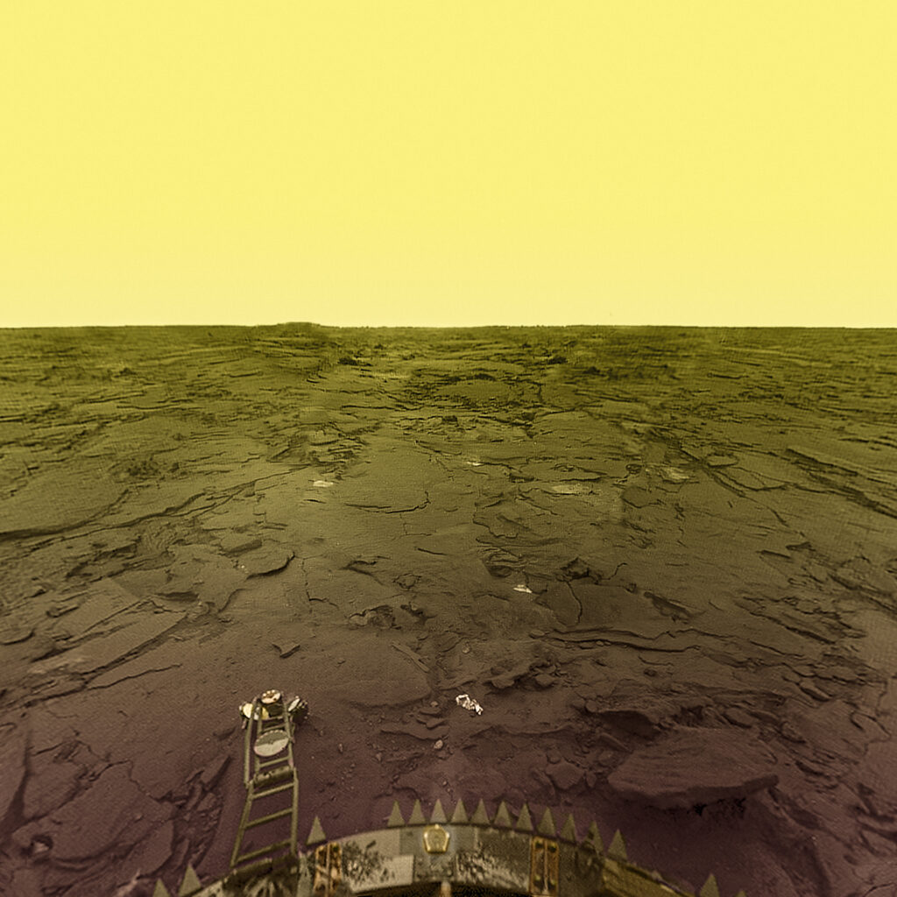

# LIVE: The Light in Venus Exploration 

## Team

We are a team of mechatronics engineers that seeks to solve space problems, and 
in this competition, NASA gives us the opportunity to solve them.

We developed an energy storage system based on sodium-sulfur batteries to 
supply energy for missions to Venus for landers and rovers, making them able to 
rely on energy resources for much longer than we have been able to achieve since 
the first missions began in 1961 with the Venera 1. **REFERENCE TODO**

This system consists of the same technology with two applications, the main one 
being an independent energy storage system and the secondary one, a system that 
could be installed in future missions to landers, in this case we referred to 
the Venera lander 13 and 14, However, this alternative is functional 
for future DAVINCI and Zephyr missions. 

We also propose a chemical-thermal process from which we can generate 
energy thanks to the CO2 that represents 96% of the composition of the 
atmosphere of Venus, in this way we strengthen our proposal for an independent 
energy system (Light In Venus Explorations, from now on, LIVE) to power the rovers 
in future missions, with the ability also for automatic robots to perform battery changes between the landers and LIVE.

We learned a lot, this has been one of the most demanding challenges for us in 
scientific and investigative terms given the hostile conditions of Venus and 
the usual factors in the aerospace industry.

Thank you for reading! <3

## Introduction to the problem

Venus has a size, mass and internal composition similar to Earth, however, 
everything else that makes up this interesting planet makes reconnaissance and 
exploration missions impossible for researchers and scientists who seek to know 
more about its composition of its atmosphere and its evolution, 
gas composition, among others. **REFERENCE TODO**

**Figure TODO** - 

Space research, and therefore human curiosity, has no limits, so atmospheric, 
pressure and temperature conditions have not been an excuse to carry out space 
missions related to Venus.

Our team's challenge is to develop an energy storage system for a surface 
lander or a rover that stays on the surface of Venus for at least 60 days, thus 
providing a solution for viable long-term energy storage.

**Figure TODO** - The Apollo 16 Extended Apollo Lunar Module

The objectives that the competition exposes us are based on selecting 
technologies that are consistent with the challenge, the things that we had in 
mind when developing the solution are the following:

- Energy storage
- Power source
- Effective applicability of the solution on Venus
- Self-discharge rate
- Volume
- Dough
- Operation temperature range
- Usage of protective enclosure
- Whether the system can be recharged
- Whether the system uses in situ resources from Venus (e.g., CO2)
- Whether the system can tolerate the forces and vibrations due to launch, reentry, descent, and landing
- Whether the system can tolerate partial failure and still provide energy

## State-of-Art

### **Venera Missions**

Missions to Venus take place since 1961 with Venera 1, however, the first 
mission accomplished was with Mariner 2 on December 14, 1962, acquiring data on 
the surface and atmosphere of Venus. **REFERENCE TODO**

One of the most important missions was that of Venera 4, it was a probe in the 
Soviet Venera program for the exploration of Venus. This probe consisted of a 
special landing module to enter the atmosphere of Venus. **REFERENCE TODO**

This mission allowed us to learn about the temperature and atmospheric 
composition of Venus in a much more precise way.

**Figure TODO** - Venera 4 model.

Missions like this one are state of the art for this research, since although 
they differ from energy storage, they allow us to investigate previously proven 
components, such as the sodium-sulfur batteries used in the Sodium Sulfur 
Battery Cell Experiment (NaSBE) in 1996 through a paper published by Ford Motor Company. 
**REFERENCE TODO**

### **Automaton Rover for Extreme Environments (AREE)**

**Figure TODO** - Automaton Rover for Extreme Environments (AREE) graphical representation.

NASA Jet Propulsion Laboratory designed a concept of automaton rover based on 
ancient mechanical computers with modern manufacturing technology to enable the 
exploration of Venus, known for being one of the most extreme environments in 
the Solar System. [TODO](https://www.nasa.gov/feature/automaton-rover-for-extreme-environments-aree/)

AREE uses a hybrid energy storage system made up of a Composite Spring and 
Sodium Metal Chloride Batteries for the advantages that both bring since the 
automaton uses its mechanical energy supply directly to power its locomotion 
system. The instruments that cannot use mechanical energy are powered by 
batteries, which also have a greater energy density than the mechanical energy 
storage system. [TODO](https://www.nasa.gov/sites/default/files/atoms/files/niac_2016_phasei_saunder_aree_tagged.pdf)

## Storage and Source Selection

To promote future missions such as DAVINCI and Zephyr, our team set out to investigate the 
different types of energy storage, based on the new explorations that need to 
be carried out on the surface of Venus.

This research takes place on the resources provided for the competition, the 
experience we have accumulated participating in the previous years and the 
professional knowledge that we were able to apply in academic investigation.

Our investigation began with the following sections:

- Thermal batteries (mainly LiCoS2)
- Sodium-sulphur batteries
- Sodium Metal Chloride Battery
- Lithium Carbonate Battery
- Lithium sulfide batteries

**Figure TODO** - Diagram of the Sodium sulfur battery cell diagram, extracted from **REFERENCE TODO**

Assessing the sections exposed in the competition, and the following:

- Storage Capacity energy
- Source of energy
- Rate of use
- Self-discharge rate
- Whether the system can be recharged
- Using the energy released on atmospheric entry and descent

Using the resources **(Batteries for Venus Surface Operation and Energy Storage 
Technologies for Future Planetary Science Missions)** **REFERENCE TODO** We were able to learn 
more about the applications and limitations of each type of battery.

Most batteries were discarded due to their inefficiency in terms of energy 
density compared to the others, the main comparison arose between:

- A. Lithium sulfide batteries
- B. Sodium-sulphur batteries
- C. Lithium Carbonate Battery

After further investigation of possible options, Lithium Carbonate Battery (C) 
was dropped due to a lack of application-related research that limits our scope 
and appreciation of this alternative.

Lithium sulfide batteries (A) have been part of the biggest changes in different 
technological sectors in recent years, from electric vehicles, consumer 
electronics and space is no exception. It has a great energy density (theoretical = 2735 Wh · kg-1), is safe due to the higher ionization energy of lithium vs. sodium, and its discharge product, Li2S, is not corrosive. (High Energy, Long Cycle Life, and Extreme Temperature Lithium-Sulfur Battery for Venus Missions **REFERENCE TODO**) However, this concept is highly difficult to implement for such conditions on Venus, specially for the temperature, since modern LiS batteries reaches up to 80 °C as their maximum survivable temperature. Even if its implementation its possible, it would require a complex temperature refrigeration/isolation system, which by itself would consume a large amount of energy, maybe more than the entire lander/rover would need for its normal operation. (Energy Storage Technologies for Future Planetary Science Missions **REFERENCE TODO**, pag 55)

On the other hand, Sodium-sulfur (B) batteries, due to their chemical composition, are an 
excellent candidate for this application, being one of the few options that 
have already been implemented in previous missions, like the deployment made in the STS-87 space shuttle in November 1997 (Batteries for Venus Surface Operation **REFERENCE TODO**). It is a great option for harhs  environments, despite having a lower power density than options such 
as lithium sulfide batteries (A) and has brittleness in the solid beta-alumina electrolyte.
electrolyte. (Batteries for Venus Surface Operation **REFERENCE TODO**)

Later in the section on "Energy Storage Type" we will be explaining how this 
selection will help us effectively meet the challenge.

## Materials Selection 🚧🚧🚧🚧

The batteries to be used are based on Sodium-Sulfur.

Sodium–sulfur batteries were initially
developed as a high-specific-energy rechargeable battery system
with a low self-discharge rate for electric vehicles. They are currently
being demonstrated in electric utility applications to serve as an
energy storage system to store energy for use during peak demand
periods. Such batteries have demonstrated hundreds of charge/discharge cycles with a low decrease in capacity. (Batteries for Venus Surface Operation **REFERENCE TODO**)

These batteries consists of 3 main parts, which are presented in the following working diagram. 

**Figure TODO** - Sodium-sulfur battery working diagram, extracted from [NGK INSULATORS, LTD](http://www.unido.or.jp/en/technology_db/4394/).

During the discharge stage, the specific capacity tends to increase while the voltage is decreasing. It reaches a point where it reaches the maximum capacity, but the voltage would be so low that it could no longer maintain its power to feed the systems. 

\  

**Figure TODO** - Sodium-sulfur battery voltage-specific capacity graphical behavior, extracted from [Research Progress toward Room Temperature Sodium Sulfur Batteries: A Review](https://www.mdpi.com/1420-3049/26/6/1535)

### 1. Cathode materials 🚧🚧🚧🚧

The material of excellence for this purpose is elemental sulfur due to its high theoretical specific capacity when combined with lithium, and the fact that it is very low cost and non-toxic.

### 2. Anode materials 🚧🚧🚧🚧

When reacting with lithium (the anode), the sulfur prevents the formation of Li dendrites in a great extent due to the dissolved polysulfides (PS). This prevents efficiency problems.

### 3. Electrolyte 🚧🚧🚧🚧

A favorable selection for electrolyte solvents is the **dimethyl ether (DME)**, and **1, 3-dioxolane (DOL)**. But its proved that the best choice is the **Lithium trifluoromethanesulfonate (LiSO3CF3)**.

### 4. Chamber 🚧🚧🚧🚧 

Due to the extreme environment of Venus, the batteries needs to be located in a 
camera capable of resisting high temperatures, pressure, and its acidic 
atmosphere. For this task, the material selected was **Inconel** alloy 718, which 
is a high-strength, corrosion resistant nickel chromium material that can be 
used at -423°F at 1300°F (commonly used for aerospace applications). [TODO](https://www.specialmetals.com/documents/technical-bulletins/inconel/inconel-alloy-718.pdf)

## Process Selection

## Design

The LIVE system (Light in Venus Exploration) is an energy storage system that works through two concepts:

1.- The adaptation of a bank of sodium-sulfur batteries to the landers of future space missions, we made the concept through the Venera 13 and 14 model and with an energy estimate through exhausting a research exercise that we will develop later in this document.

 🚧 la foto de venera va aquí

This system has a quantity of 5,214 sodium-sulfur batteries with the capacity to supply a demand expressed in the graphs attached to this web page for just over 60 days. This system is compatible with future space missions such as Davinci, a mission that will send a probe to Venus to collect much more information than we have collected in the past 30 years.

Although this battery bank appears to have a uniform body, the batteries and the plates that join them have a particular packing, which allows them to continue operating despite damage to segments of the battery bank, allowing us to have a design that manages to work partially. in case of mission criticality.

 🚧 Vista aerea 1

We achieve this through location points located in the batteries and some grooves that manage to close the circuit when they are placed, in the event of an abrupt collision, the battery bank has an internal system that rejects these batteries (given their lack of contact) and thus closes the circuit at the next station.

 🚧 Foto batería

This battery bank is asymmetrical, allowing us to see ourselves supported by the Veneras 14 at its very base and without providing major complications in its "launching mass", since LIVE contributes approximately 1,100 pounds to the general system.

 🚧 Vista aerea 2

The implementation of this system gives us the possibility of obtaining information from Venus for more than 60 days, invaluable information since previously different probes (Mariner and Veneras) were sent intermittently on different missions to collect information, however, these used to last less from one hour to less than 20 minutes.

Our goal is to provide a solution that can scale those times and continue to receive reliable results from the well-made and expensive devices that we send to this infernal planet called venus.

 🚧 Vista perfil

### Working Principle

## Solution

The following plot illustrates the depletion of the total energy through 60 
days of the system, which is the minimum time required for this project. These 
lines represent the energy required by the system to complete all its functions.

To compare, the Perseverance rover, which is a massive mobile laboratory, can 
reach up to 900 watts during science activities. [Perseverance Powe]

If the required energy of the system increases, then its number of batteries 
also has a proportional increment. The following plot show the number of 
batteries required by the system in function of its total energy demanded.

## Conclusion

## References

- [Automaton Rover for Extreme Environments (AREE)](https://www.nasa.gov/feature/automaton-rover-for-extreme-environments-aree/)
- [Report: Automaton Rover for Extreme Environments](https://www.nasa.gov/sites/default/files/atoms/files/niac_2016_phasei_saunder_aree_tagged.pdf)
- [High specific energy Lithium Sulfur cell for space application](https://www.e3s-conferences.org/articles/e3sconf/abs/2017/04/e3sconf_espc2017_08006/e3sconf_espc2017_08006.html)

- [1] [Space Food - NASA](https://www.nasa.gov/content/space-food-systems)
- [2] [Growing Plants in Space - NASA](https://www.nasa.gov/content/growing-plants-in-space)
- [3] [Veg-03 Plant Pillows Readied at Kennedy Space Center for Trip to Space Station – Kennedy Space Center (nasa.gov)](https://blogs.nasa.gov/kennedy/2016/04/08/veg-03-plant-pillows-readied-at-kennedy-space-center-for-trip-to-space-station/)

No sé cómo poner referencias, :v

- [SODIUM SULFUR BATTERY CELL EXPERIMENT (NaSBE)](https://ntrs.nasa.gov/api/citations/19970013741/downloads/19970013741.pdf)

[Venera 4 - LaSpace.ru](https://web.archive.org/web/20140222000836/http://www.laspace.ru/rus/venera4.php)

[Batteries for Venus Surface Operation](https://arc.aiaa.org/doi/abs/10.2514/1.41886?journalCode=jpp#:~:text=Three%20well%2D%20developed%20battery%20chemistries,qualification%20readiness%20for%20aerospace%20applications.)

[Energy Storage Technologies for Future Planetary Science Missions](https://solarsystem.nasa.gov/resources/549/energy-storage-technologies-for-future-planetary-science-missions/)

[High Energy, Long Cycle Life, and Extreme Temperature Lithium-Sulfur Battery for Venus Missions](https://techport.nasa.gov/view/92914)

https://web.archive.org/web/20161228043210/http://astronautix.com/v/venera1vv-67.html

Lithium-sulphur batteries: opportunities and challenges for
space applications  de Géraldine Palissat* 

High specific energy Lithium Sulfur cell for space application
Bruno Samaniego(1), Emmanuelle Carla (1), Laura O’Neill (2), Maria Nestoridi (3)

Energy Storage Technologies
for Future Planetary Science Missions
(JPL D-101146)

High Specific Energy Lithium Primary Batteries as Power Sources
for Deep Space Exploration
Frederick C. Krause,1 John-Paul Jones,1,∗ Simon C. Jones,1 Jasmina Pasalic,1
Keith J. Billings,1 William C. West,1 Marshall C. Smart,1,∗ Ratnakumar V. Bugga,1,∗
Erik J. Brandon, 1,∗,z and Mario Destephen2

https://www.haynesintl.com/tech-briefs/high-temperature-alloys/high-temperature-alloy-applications/high-temperature-alloys-for-industrial-applications-(H-3116)

https://www.sciencedirect.com/topics/materials-science/high-temperature-alloys
