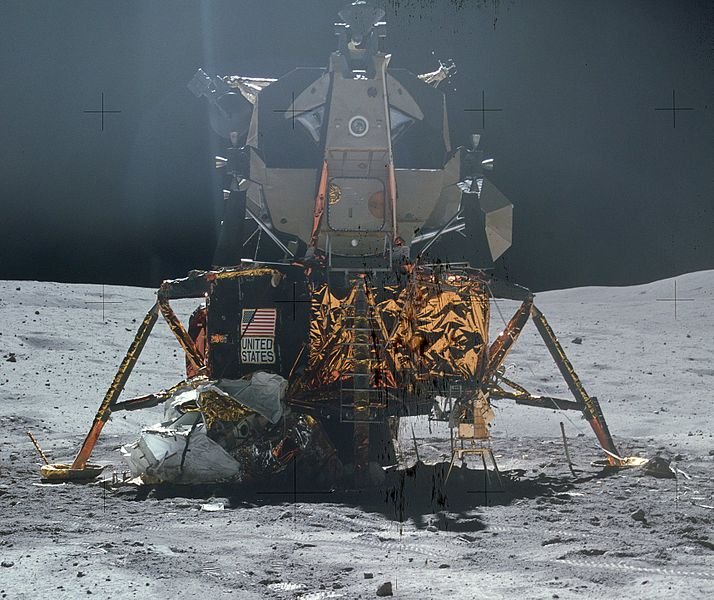
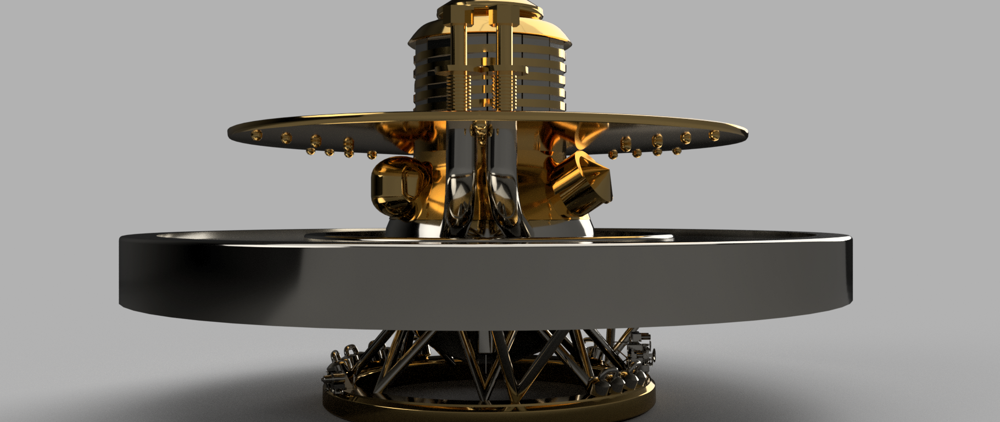
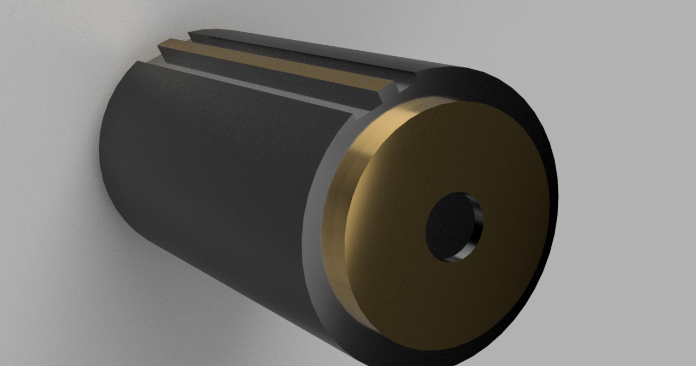
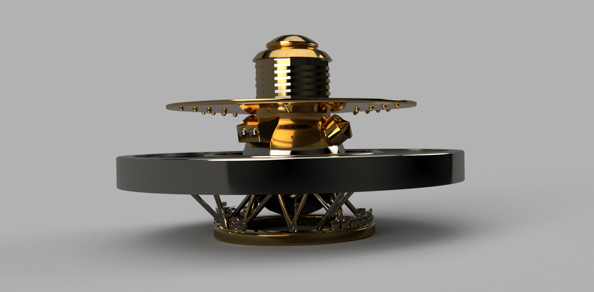

# LIVE: The Light in Venus Exploration 

## Table of Contents

- [LIVE: The Light in Venus Exploration](#live-the-light-in-venus-exploration)
  - [Table of Contents](#table-of-contents)
  - [Team](#team)
  - [Introduction to the problem](#introduction-to-the-problem)
  - [State-of-Art](#state-of-art)
    - [**Venera Missions**](#venera-missions)
    - [**Automaton Rover for Extreme Environments (AREE)**](#automaton-rover-for-extreme-environments-aree)
  - [Storage and Source Selection](#storage-and-source-selection)
  - [Materials Selection](#materials-selection)
  - [Solution](#solution)
    - [Calculations](#calculations)
    - [Design and working principles](#design-and-working-principles)
  - [Conclusion](#conclusion)
  - [Recommendations](#recommendations)
  - [References](#references)

## Team

 

 

We are a team of mechatronics engineers that seeks to solve space problems, and in this competition, NASA gives us the opportunity to solve them.

We developed an energy storage system based on sodium-sulfur batteries to supply energy for missions to Venus for landers and rovers, making them able to rely on energy resources for much longer than we have been able to achieve since the first missions began in 1961 with the Venera 1.[1](https://nssdc.gsfc.nasa.gov/nmc/spacecraft/display.action?id=1961-003A)

This system consists of the same technology with two applications, the main one being an independent energy storage system and the secondary one, a system that could be installed in future missions to landers, in this case we referred to the Venera lander 13 and 14, However, this alternative is functional for future DAVINCI and Zephyr missions. 

We also propose a chemical-thermal process from which we can generate energy thanks to the CO2 that represents 96% of the composition of the atmosphere of Venus, in this way we strengthen our proposal for an independent energy system (Light In Venus Explorations, from now on, LIVE) to power the rovers in future missions, with the ability also for automatic robots to perform battery changes between the landers and LIVE. [13](https://www.britannica.com/place/Venus-planet)

We learned a lot, this has been one of the most demanding challenges for us in scientific and investigative terms given the hostile conditions of Venus and the usual factors in the aerospace industry.

Thank you for reading! <3

## Introduction to the problem

Venus has a size, mass and internal composition similar to Earth, however, everything else that makes up this interesting planet makes reconnaissance and exploration missions impossible for researchers and scientists who seek to know more about its composition of its atmosphere and its evolution, gas composition, among others.[2](https://solarsystem.nasa.gov/news/1519/venus-resources/?page=0&per_page=40&order=created_at+desc&search=&tags=Venus&category=324)

 

 

**Figure 1** - Venus surface, extracted from [NASA Venus Resources](https://solarsystem.nasa.gov/news/1519/venus-resources/?page=0&per_page=40&order=created_at+desc&search=&tags=Venus&category=324).

Space research, and therefore human curiosity, has no limits, so atmospheric, pressure and temperature conditions have not been an excuse to carry out space missions related to Venus.

Our team's challenge is to develop an energy storage system for a surface lander or a rover that stays on the surface of Venus for at least 60 days, thus providing a solution for viable long-term energy storage.

 

 

**Figure 2** - The Apollo 16 Extended Apollo Lunar Module

The objectives that the competition exposes us are based on selecting technologies that are consistent with the challenge, the things that we had in mind when developing the solution are the following:

- Energy storage
- Power source
- Effective applicability of the solution on Venus
- Self-discharge rate
- Volume
- Dough
- Operation temperature range
- Usage of protective enclosure
- Whether the system can be recharged
- Whether the system uses in situ resources from Venus (e.g., CO2)
- Whether the system can tolerate the forces and vibrations due to launch, reentry, descent, and landing
- Whether the system can tolerate partial failure and still provide energy

## State-of-Art

### **Venera Missions**

Missions to Venus take place since 1961 with Venera 1. However, the first mission accomplished was with Mariner 2 on December 14, 1962, acquiring data on the surface and atmosphere of Venus.[3](https://web.archive.org/web/20150118202749/http://solarsystem.nasa.gov/missions/profile.cfm?MCode=Mariner_02)

One of the most important missions was that of Venera 4. It consisted of a probe in the Soviet Venera program for the exploration of Venus. This probe consisted of a special landing module to enter the atmosphere of Venus.[4](https://nssdc.gsfc.nasa.gov/nmc/spacecraft/display.action?id=1967-058A)

This mission allowed us to learn about the temperature and atmospheric composition of Venus in a much more precise way.

 

 

**Figure 3** - Venera 4 model.

Missions like this one are state of the art for this research, since, although they differ from energy storage, they allow us to investigate previously proven 
components, such as the sodium-sulfur batteries used in the Sodium Sulfur Battery Cell Experiment (NaSBE) in 1996 through a paper published by Ford Motor Company.[5](https://ntrs.nasa.gov/api/citations/19970013741/downloads/19970013741.pdf)

### **Automaton Rover for Extreme Environments (AREE)**

 

 

**Figure 4** - Automaton Rover for Extreme Environments (AREE) graphical representation.

NASA Jet Propulsion Laboratory designed a concept of automaton rover based on ancient mechanical computers with modern manufacturing technology to enable the exploration of Venus, known for being one of the most extreme environments in the Solar System.[6](https://www.nasa.gov/feature/automaton-rover-for-extreme-environments-aree/)

AREE uses a hybrid energy storage system made up of a Composite Spring and Sodium Metal Chloride Batteries for the advantages that both bring since the automaton uses its mechanical energy supply directly to power its locomotion system. The instruments that cannot use mechanical energy are powered by batteries, which also have a greater energy density than the mechanical energy storage system.[7](https://www.nasa.gov/sites/default/files/atoms/files/niac_2016_phasei_saunder_aree_tagged.pdf)

## Storage and Source Selection

To promote future missions such as DAVINCI and Zephyr, our team set out to investigate the different types of energy storage, based on the new explorations that need to be carried out on the surface of Venus.

 

 

This research takes place on the resources provided for the competition, the experience we have accumulated participating in the previous years and the professional knowledge that we were able to apply in academic investigation.

Our investigation began with the following sections:

- Thermal batteries (mainly LiCoS2)
- Sodium-sulfur batteries
- Sodium Metal Chloride Battery
- Lithium Carbonate Battery
- Lithium sulfide batteries

 

 

**Figure 5** - Diagram of the Sodium sulfur battery cell diagram, extracted from [SODIUM SULFUR BATTERY CELL EXPERIMENT (NaSBE)](https://ntrs.nasa.gov/api/citations/19970013741/downloads/19970013741.pdf)

Assessing the sections exposed in the competition, and the following:

- Storage Capacity energy
- Source of energy
- Rate of use
- Self-discharge rate
- Whether the system can be recharged
- Using the energy released on atmospheric entry and descent

Using the resources from some interesting papers (such as [8](https://arc.aiaa.org/doi/abs/10.2514/1.41886?journalCode=jpp#:~:text=Three%20well%2D%20developed%20battery%20chemistries,qualification%20readiness%20for%20aerospace%20applications.) and [9](https://solarsystem.nasa.gov/resources/549/energy-storage-technologies-for-future-planetary-science-missions/) ) We were able to learn more about the applications and limitations of each type of battery.

Most batteries were discarded due to their inefficiency in terms of energy density compared to the others, the main comparison arose between:

- A. Lithium sulfide batteries
- B. Sodium-sulphur batteries
- C. Lithium Carbonate Battery

After further investigation of possible options, Lithium Carbonate Battery (C) was dropped due to a lack of application-related research that limits our scope and appreciation of this alternative.

Lithium sulfide batteries (A) have been part of the biggest changes in different technological sectors in recent years, from electric vehicles, consumer electronics and space is no exception. It has a great energy density (theoretical = 2735 Wh · kg-1), is safe due to the higher ionization energy of lithium vs. sodium, and its discharge product, Li2S, is not corrosive.[10](https://techport.nasa.gov/view/92914) However, this concept is highly difficult to implement for such conditions on Venus, specially for the temperature, since modern LiS batteries reaches up to 80 °C as their maximum survivable temperature. Even if its implementation its possible, it would require a complex temperature refrigeration/isolation system, which by itself would consume a large amount of energy, maybe more than the entire lander/rover would need for its normal operation.[9](https://solarsystem.nasa.gov/resources/549/energy-storage-technologies-for-future-planetary-science-missions/)

On the other hand, Sodium-sulfur (B) batteries, due to their chemical composition, are an excellent candidate for this application, being one of the few options that have already been implemented in previous missions, like the deployment made in the STS-87 space shuttle in November 1997[8](https://arc.aiaa.org/doi/abs/10.2514/1.41886?journalCode=jpp#:~:text=Three%20well%2D%20developed%20battery%20chemistries,qualification%20readiness%20for%20aerospace%20applications.). It is a great option for harsh environments, despite having a lower power density than options such as lithium sulfide batteries (A) and has brittleness in the solid beta-alumina electrolyte.[8](https://arc.aiaa.org/doi/abs/10.2514/1.41886?journalCode=jpp#:~:text=Three%20well%2D%20developed%20battery%20chemistries,qualification%20readiness%20for%20aerospace%20applications.)

Later on, in the "Solution" solution, we will be explaining how this selection will help us effectively meet the challenge.

## Materials Selection

The batteries to be used are based on Sodium-Sulfur.

Sodium–sulfur batteries were initially developed as a high-specific-energy rechargeable battery system with a low self-discharge rate for electric vehicles. They are currently being demonstrated in electric utility applications to serve as an energy storage system to store energy for use during peak demand periods. Such batteries have demonstrated hundreds of charge/discharge cycles with a low decrease in capacity.[8](https://arc.aiaa.org/doi/abs/10.2514/1.41886?journalCode=jpp#:~:text=Three%20well%2D%20developed%20battery%20chemistries,qualification%20readiness%20for%20aerospace%20applications.)

These batteries consist of 3 main parts, which are presented in the following working diagram:

- **Cathode:** An outer layer of sulfur as the base element.
- **Anode:** The inner part composed of sodium, where the element reacts with the cathode via the electrolyte substance.
- **Electrolyte:** It consists of a beta-alumina solid oxide. This electrolyte also serves as a separator between the liquid sodium anode and the liquid sulfur cathode. At operating temperatures above about 300 °C, sodium ions are mobile in the solid-electrolyte material.

Because of the relative impermeability of the solid electrolyte, the self-discharge rate of the NaS battery is extremely low. [8](https://arc.aiaa.org/doi/abs/10.2514/1.41886?journalCode=jpp#:~:text=Three%20well%2D%20developed%20battery%20chemistries,qualification%20readiness%20for%20aerospace%20applications.)

 

 

**Figure 6** - Sodium-sulfur battery working diagram, extracted from [NGK INSULATORS, LTD](http://www.unido.or.jp/en/technology_db/4394/).

During the discharge stage, the specific capacity tends to increase while the voltage is decreasing. It reaches a point where it reaches the maximum capacity, but the voltage would be so low that it could no longer maintain its power to feed the systems. 

 

 

**Figure 7** - Sodium-sulfur battery voltage-specific capacity graphical behavior, extracted from [Research Progress toward Room Temperature Sodium Sulfur Batteries: A Review](https://www.mdpi.com/1420-3049/26/6/1535)

Also, but not least, due to the extreme environment of Venus, the batteries needs to be located in a camera capable of resisting high temperatures, pressure, and its acidic atmosphere. For this task, the material selected was **Inconel 718** allow, which is a high-strength, corrosion resistant nickel chromium material that can be used at -423 °F at 1300 °F (commonly used for aerospace applications).[11](https://www.specialmetals.com/documents/technical-bulletins/inconel/inconel-alloy-718.pdf) This material also would be implemented as the cover for the prototype black halo, which will be depicted later on. 

Let us continue with the following solution section, based on the made selection.  

## Solution

This section will consist of two main parts: the **Calculations** subsection, in which details such as the specific energy is used for feeding the system, and the **Design** subsection depicts our final prototype of the proposed model.

### Calculations

The properties of the selected battery, sodium-sulpur, are shown in this table, extracted from the [Energy Storage Technologies for Future Planetary Science Missions, page. 44](https://solarsystem.nasa.gov/resources/549/energy-storage-technologies-for-future-planetary-science-missions/):

|           Characteristic            | Na-S |
|-------------------------------------|------|
|Specific Energy for Batteries (Wh/kg)|80-120|
| Energy Density for Batteries (Wh/l) |90-150|

From the properties of a sodium-sulfur battery, we took their mean value and perform multiple calculations to obtain the parameters that the energy storage system needs to be designed. All these calculations can be seen in the Jupyter Notebook available in the repository of the project: [Project Repository](https://github.com/chris-roman/HEX-LOV)

The following plot illustrates the depletion of the total energy through 60 days of the system, which is the minimum time required for this project. These lines represent the energy required by the system to complete all its functions.

To compare, the Perseverance rover, which is a massive mobile laboratory, can reach up to 900 watts during science activities. [TODO](https://www.jpl.nasa.gov/news/press_kits/mars_2020/launch/mission/spacecraft/power/)

 

 

**Figure 8** - Energy depleted by the system in 60 days, in function of time (in hours).

If the required energy of the system increases, then its number of batteries also has a proportional increment. The following plot shows the number of batteries required by the system in function of its total energy demanded.

 

 

**Figure 9** - Number of batteries required by the system, in function of the needed energy (in Watts).

### Design and working principles

The LIVE system (Light in Venus Exploration) is an energy storage system that works through two concepts:

1. The adaptation of a bank of sodium-sulfur batteries to the landers of future space missions, we made the concept through the Venera 13 and 14 model and with an energy estimate through exhausting a research exercise that we will develop later in this document.

 

 

**Figure 10** - Venera 14 3D model, extracted from [TURBOSQUID](https://www.turbosquid.com/3d-models/venera13-venera14-space-probe-3d-model-1865382)

This system has a quantity of 5,214 sodium-sulfur batteries with the capacity to supply a demand expressed in the graphs attached to this web page for just over 60 days. This system is compatible with future space missions such as DAVINCI, a mission that will send a probe to Venus to collect much more information than we have collected in the past 30 years.

Although this battery bank appears to have a uniform body, the batteries and the plates that join them have a particular packing, which allows them to continue operating despite damage to segments of the battery bank, allowing us to have a design that manages to work partially in case of mission criticality.

  

**Figure 11** - LIVE 3D Model, side view

We achieve this through location points located in the batteries and some grooves that manage to close the circuit when they are placed, in the event of an abrupt collision, the battery bank has an internal system that rejects these batteries (given their lack of contact) and thus closes the circuit at the next station.

  

**Figure 12** - LIVE 3D Model, battery view

This battery bank is asymmetrical, allowing us to see ourselves supported by the Venera 14 at its very base and without providing major complications in its "launching mass", since LIVE contributes approximately 1,100 pounds to the general system.

  

**Figure 13** - LIVE 3D Model, side view 

The implementation of this system gives us the possibility of obtaining information from Venus for more than 60 days, invaluable information since previously different probes (Mariner and Venera) were sent intermittently on different missions to collect information, however, these used to last less from one hour to less than 20 minutes.

Our goal is to provide a solution that can scale those times and continue to receive reliable results from the well-made and expensive devices that we send to this infernal planet called Venus.

  

**Figure 14** - LIVE 3D Model, top view

1. The second concept that can take place with this research is called OASIS, since it turns out to be a battery bank that makes a landing as well as landers and probes to provide energy to future explorations and the rovers that are part of them.

It has 12,170 batteries that can supply 100 Wh/Kg (the same batteries as the first concept, more information in the other). The way that the rovers have to feed is through the extremities that they use to hold the scientific instruments that in the case of perseverance are several, instead of holding these sensors, they would only use one extremity to connect to the OASIS, having the female connector and OASIS, the male can make a locating connection due to the design of the fit of these.

 

**Figure 15** - LIVE 3D Model, several units deployed in the OASIS.

The rovers would have to be programmed for a scanning radius of no more than 2,000 feet, since the technology with which the rovers will recognize OASIS would be UWB.

According to Johnson Space applied technology for the development of real-time locating system (RTLS) "It uses ultra-wideband (UWB) radio frequency signals for tracking. UWB is a low-power, carrier-free, ultra-wide bandwidth signal transmission that has 100 to 1,000 times finer time resolution than conventional narrowband radio frequencies. UWB also has a lower power spectral density, allowing it to coexist with other wireless communications systems, such as Wi-Fi and cellular. The system has a tracking resolution of less than 1 percent of a range up to 2,000 feet. The tracking methodology is a calculation consisting of Angle of Arrival (AoA) and Time Difference of Arrival (TDOA). Originally designed for use in tracking lunar and Mars rovers, robots, and astronauts during exploration missions where satellite navigation systems are not available, the technology has a number of terrestrial applications including long-range tracking of emergency personnel in remote or hostile environments ts. JSC has applied for patent protection for this technology".[12](https://www.nasa.gov/centers/johnson/techtransfer/technology/MSC-24184-1-uwb-aoa-tracking.html)

With the implementation of this technology, the Rovers will be able to determine their proximity to the different OASIS and, in turn, position themselves at the points to take energy from them, greatly prolonging their useful life and, therefore, exploration time.

**Figure 16** - LIVE 3D Model, several units deployed in the OASIS.

## Conclusion

The proposed model is capable of being deployed in two ways that could potentially support two system paradigms: a **Lander system** and a **Rover system**. The former is meant to feed a single Lander unit for several days while resisting against the harsh conditions of the Venus atmosphere. It consists of nearly 5,000 unit sodium-sulfur batteries (each one of 100 Wh/kg) that withstands the Lander for 60 days. By the other hand, the **Rover system** consists of a large set of battery packages, each unit with the same features of the aforementioned, but each "oasis" is based on 12,000, large enough to feed several Rover units around. One great advantage of the "oasis" is that it has enabled UWB communication that allows to establish a direct link with any nearby Rover.

Both paradigms allow to deploy any of these systems based on the scientific needs and future explorations. Even if the environment is extreme and presents such high difficulties for letting scientists research further, there is always a possibility in with technological advances can withstand such problems. Every year, science-materials fields create new materials that keep growing in physical resistance (such as corrosion, pressure, temperature, electric field, etc.), and the combination of these new formulae allows creating way more advance equipment, battery included. It is just a matter of time for humanity to get solutions that reduces these constraints substantially further. 

That said, the first step is to guarantee any device to recollect as much information as possible, so another new generation can establish colonies for greater purposes, and who knows if another mission is destined for changing the environment itself :)  

## Recommendations

As future lines, it is important to highlight some points.

Research in relation to lithium-sulfide batteries and Lithium Carbonate Battery missions in the space context needs to continue to be developed, the energy superiority of these batteries is quite remarkable and would contribute a lot for long-lasting batteries. Not to mention that they are lighter than most options for space missions.

We have met many technological challenges since we went to Venus for the last time, this technological improvement represents a wave of improvements that can be implemented in new missions, among these are the use of more efficient batteries, UWB, new materials and chemical processes of use of the CO2 that embraces 96% of Venus.

## References

- [1] [Venera 1 - NASA Space Science Data Coordinated Archive](https://nssdc.gsfc.nasa.gov/nmc/spacecraft/display.action?id=1961-003A)
- [2] [The second planet from the Sun and Earth's closest planetary neighbor, Venus](https://solarsystem.nasa.gov/news/1519/venus-resources/?page=0&per_page=40&order=created_at+desc&search=&tags=Venus&category=324)
- [3] [Mariner 2 - NASA Solar System Exploration](https://web.archive.org/web/20150118202749/http://solarsystem.nasa.gov/missions/profile.cfm?MCode=Mariner_02)
- [4] [Venera 4 - NASA Space Science Data Coordinated Archive](https://nssdc.gsfc.nasa.gov/nmc/spacecraft/display.action?id=1967-058A)
- [5] [SODIUM SULFUR BATTERY CELL EXPERIMENT (NaSBE)](https://ntrs.nasa.gov/api/citations/19970013741/downloads/19970013741.pdf)
- [6] [Automaton Rover for Extreme Environments (AREE) - NASA](https://www.nasa.gov/feature/automaton-rover-for-extreme-environments-aree/)
- [7] [Report: Automaton Rover for Extreme Environments - NASA Innovative Advanced Concepts (NIAC) Phase I](https://www.nasa.gov/sites/default/files/atoms/files/niac_2016_phasei_saunder_aree_tagged.pdf)
- [8] [Landis, G., Harrison, R., Batteries for Venus Surface Operation - JOURNAL OF PROPULSION AND POWER](https://arc.aiaa.org/doi/abs/10.2514/1.41886?journalCode=jpp#:~:text=Three%20well%2D%20developed%20battery%20chemistries,qualification%20readiness%20for%20aerospace%20applications.)
- [9] [Energy Storage Technologies for Future Planetary Science Missions - NASA Planetary Science Division Science Mission Directorate](https://solarsystem.nasa.gov/resources/549/energy-storage-technologies-for-future-planetary-science-missions/)
- [10] [High Energy, Long Cycle Life, and Extreme Temperature Lithium-Sulfur Battery for Venus Missions - NASA TECHPORT](https://techport.nasa.gov/view/92914)
- [11] [INCONEL® alloy 718 - SPECIAL METALS](https://www.specialmetals.com/documents/technical-bulletins/inconel/inconel-alloy-718.pdf)
- [12] [Real-time Locating System Uses Ultra-Wideband Radio Frequency Signals for Tracking - NASA](https://www.nasa.gov/centers/johnson/techtransfer/technology/MSC-24184-1-uwb-aoa-tracking.html)
- [13] [Venus Planet](https://www.britannica.com/place/Venus-planet)